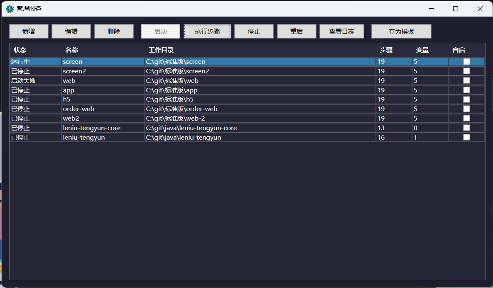
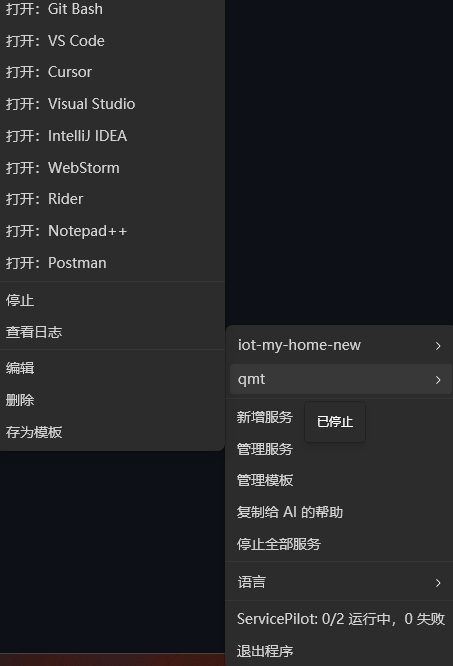
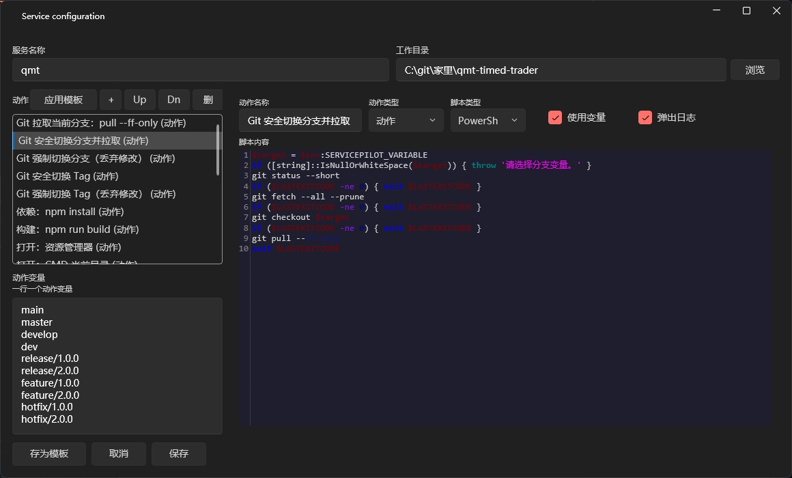
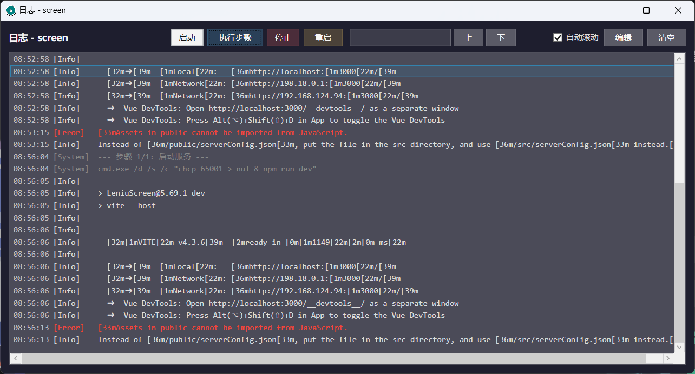
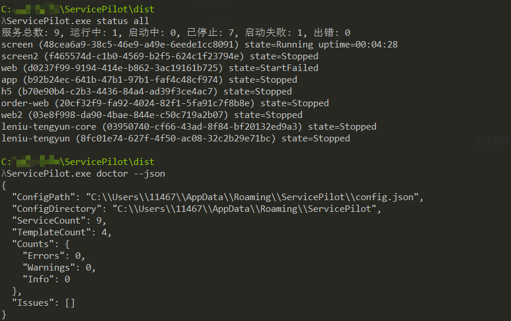
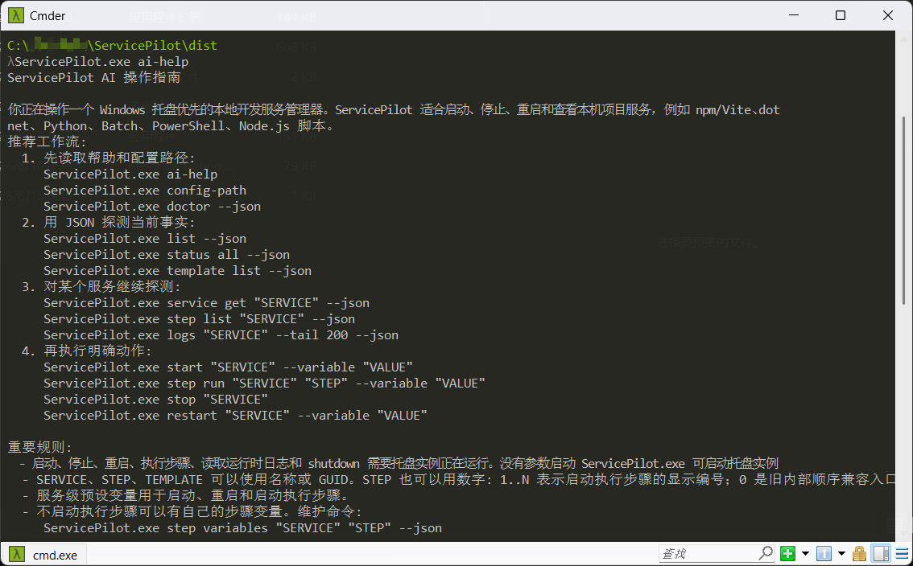

# ServicePilot

[English](README-en.md)


ServicePilot 是一个 **托盘优先、AI 友好、面向本地开发项目的 Windows 服务启动器**。它把多个项目里的前端、后端、脚本步骤、环境变量切换和日志查看收进一个托盘菜单，同时提供可被 AI/脚本稳定调用的 CLI。

```text
ServicePilot 从 Windows 托盘和 CLI 启动、监控、停止本地开发服务，让人和 AI 都能可靠操作 npm、dotnet、Python 和自定义脚本。
```

只要命令行能做到的事，通常都可以包装成 ServicePilot 步骤：切换 API 地址、拉取分支、安装依赖、打开 IDE、启动调试服务。首次启动会内置一个“默认开发动作模板”，包含 Git 分支/Tag 操作、npm 依赖/构建和常用工具打开入口；也推荐让 AI 先读取 `ai-help`、`doctor --json`、`status --json` 后，直接生成适合当前项目的服务和模板。

**下载：** [ServicePilot.exe](https://github.com/xiayukun/ServicePilot/releases/latest/download/ServicePilot.exe) | [最新发布](https://github.com/xiayukun/ServicePilot/releases/latest) | [完整用户指南](docs/user-guide.md)



| 托盘右键菜单 | 编辑服务和脚本步骤 |
| --- | --- |
|  |  |

| 实时日志窗口 | CLI / AI 状态检查 |
| --- | --- |
|  |  |

| AI 命令帮助 |
| --- |
|  |

## 快速开始

1. 下载 [`ServicePilot.exe`](https://github.com/xiayukun/ServicePilot/releases/latest/download/ServicePilot.exe)。
2. 双击启动，任务栏通知区域会出现一个数字图标。
3. 右键数字，选择 `新增服务` 或打开 `管理服务`。
4. 填写服务名称、工作目录和脚本步骤。
5. 按需填写预设变量，例如本地、测试、开发环境 API 地址。
6. 从托盘菜单、管理服务窗口、日志窗口或 CLI 启动服务。

## 核心能力

- **托盘优先**：无额外桌面面板，任务栏通知区域数字就是主入口。
- **多步骤服务**：一个服务可包含 Batch、PowerShell、Python、Node.js 步骤。
- **启动步骤 / 手动步骤**：启动流程和工具动作可以分开管理。
- **变量切换**：启动、重启、执行步骤时可选择不同预设变量。
- **完整服务模板**：模板保存名称、说明、步骤和变量，应用时保留目标工作目录。
- **内置开发动作模板**：首次启动自动提供 Git、npm、常用 IDE/终端打开等可编辑动作。
- **实时日志**：支持搜索、复制、横向滚动和有限缓存。
- **AI/脚本 CLI**：`list/status/service/step/template/logs` 支持 JSON 输出。
- **可靠停止**：使用 Windows Job Object 清理进程组，减少 Vite/npm 子进程残留占端口。
- **中英文界面**：默认跟随 Windows 语言，也可从托盘菜单切换。

## 常用 CLI

```powershell
ServicePilot.exe ai-help
ServicePilot.exe doctor --json
ServicePilot.exe list --json
ServicePilot.exe status all --json
ServicePilot.exe start "Frontend" --variable "http://localhost:9000"
ServicePilot.exe step run "Frontend" "Set API URL" --variable "http://localhost:9000"
ServicePilot.exe logs "Frontend" --tail 200 --json
ServicePilot.exe stop "Frontend"
```

完整命令、服务模型、模板、变量和 AI 工作流见 [完整用户指南](docs/user-guide.md)。

## 配置位置

```text
%APPDATA%\ServicePilot\config.json
%APPDATA%\ServicePilot\variable-usage-cache.json
```

`config.json` 保存服务和模板。`variable-usage-cache.json` 只保存最近使用排序，可删除重建。

## 从源码构建

要求：

- Windows
- .NET SDK 8.0+

```powershell
dotnet build .\ServicePilot.sln
dotnet publish .\ServicePilot\ServicePilot.csproj -c Release -r win-x64 --self-contained false -o .\dist
```

## 文档

- [完整用户指南](docs/user-guide.md)
- [AI 使用说明](docs/ai-usage.md)
- [隐私说明](PRIVACY.md)
- [贡献指南](CONTRIBUTING.md)
- [更新日志](CHANGELOG.md)

## 隐私

ServicePilot 是本地工具。它不会上传文件、路径、日志、配置或机器名。

## 许可证

MIT。
